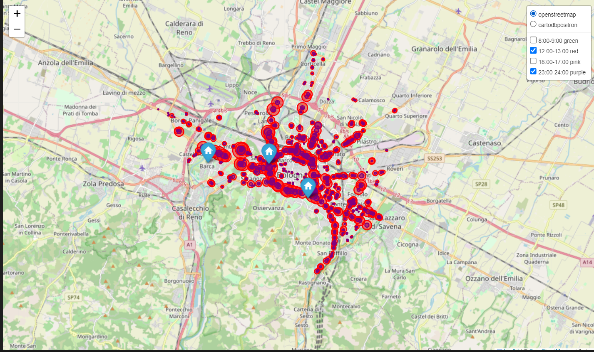

# **Analisi Traffico e Inquinamento nella città metropolitana di Bologna (2024)**

Questo progetto analizza i dati relativi al traffico veicolare e agli inquinanti atmosferici nella città di Bologna.
Il focus principale del progetto è l'amalisi dell'aspetto geografico e l'uso di reti neurali per effettuare previsioni di serie temporali.

Dati utilizzati:  
Traffico veicolare: Rilevazioni orarie del flusso veicolare tramite spire (Gennaio-Settembre 2024).  
Fonte: https://opendata.comune.bologna.it/explore/dataset/rilevazione-flusso-veicoli-tramite-spire-anno-2024/information/?disjunctive.codice_spira&disjunctive.tipologia&disjunctive.nome_via&disjunctive.stato

Inquinamento: Misurazioni di 8 agenti inquinanti da 3 centraline (Dicembre 2023 - Ottobre 2024).  
Fonte: https://opendata.comune.bologna.it/explore/dataset/centraline-qualita-aria/information/?disjunctive.agente_atm

Obiettivi:  
- Esplorazione, formattazione e pulizia dei dati.
- Analisi geospaziale del flusso di traffico veicoolare.
- Esplorare le correlazioni tra il flusso veicolare e le emissioni rilevate di PM2.5.
- Prevedere l'andamento del traffico tramite modello LSTM.

Tecnologie Utilizzate (fare riferimento al file 'requirements.txt' per installare le dipendenze utilizzate nel progetto):  
- pandas, numpy per l'analisi dei dati  
- scikit-learn per la modellazione  
- geopandas per la manipolazione e analisi di dati geospaziali  
- folium libreria basata su Leaflet.js che permette di creare mappe interettive, aggiungere marker o layer  
- shapely per la manipolazione di oggetti 2D  
- keras per il modello LSTM  
- matplotlib, seaborn per la visualizzazione

